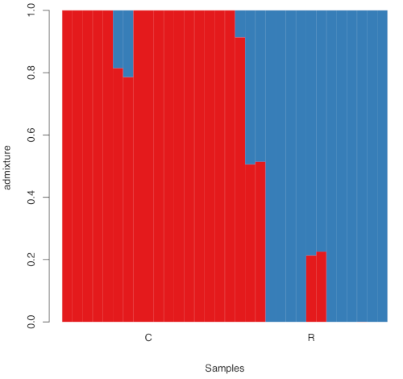

## 6. Population structure with NGSadmix

[NGSadmix](http://www.popgen.dk/software/index.php/NgsAdmix) is a programme (part of the package [ANGSD](http://www.popgen.dk/angsd/index.php/ANGSD)) for inferring admixture from genotype likelihoods, thus taking into account the uncertainty inherent to NGS data. It is similar to the famous programme [STRUCTURE](https://web.stanford.edu/group/pritchardlab/structure.html), but better suited for low-coverage NGS data. For those not familiar with this kind of approaches, these programmes allow investigating population structure by inferring individual admixture proportions given a number of populations. This allows also assigning individuals to populations and identifying migrants or admixed individuals.

We first need to conver the bcf file to beagle format with angsd:
```bash
mkdir ngsadmix
angsd -vcf-gl <(bcftools view -O v filtering/snps.bcf) -fai genome/Hmel2.fa.fai -doMaf 3 -nInd 32 -domajorminor 1 -doglf 2 -out ngsadmix/snps
```

Now prepare the script to run NGSadmix for K=2 to K=4 in parallel, using 2 cores for each task:

```bash
#!/bin/bash
#$ -l h_rt=1:00:00
#$ -l mem=2G
#$ -t 1-4
#$ -pe smp 2
#$ -m bea
#$ -M myemail@mail.com
#$ -j y
#$ -o ngsadmix.log
#$ -N ngsadmix

# internal SGE task index
K=$(($SGE_TASK_ID+1))

# log file
LOG=ngsadmix/snps_K$K.sclog

# Redirect all the following screen outputs to log file
exec > $LOG 2>&1

hostname
date
echo "=============================================================================="

# Load genomics software repository
# (safer to load it here in case the worker nodes don't inherit the environment)
source /usr/local/extras/Genomics/.bashrc 

NGSadmix \
-P 2 \
-likes ngsadmix/snps.beagle.gz \
-K $K \
-o ngsadmix/snps_K$K 

echo "=============================================================================="
date
```
When you have finished editing the bash script, save it as `ngsadmix.sh`, make it executable with chmod and submit it to the job queue with `qsub`:
```bash
chmod +x ngsadmix.sh
qsub ngsadmix.sh
```
After running, you should have the following files: 
```bash
ls -lh ngsadmix
```
>``total 136K``<br>
>``-rw-r--r-- 1 bo1vsx bo 7.0K Feb 18 04:29 snps.arg``<br>
>``-rw-r--r-- 1 bo1vsx bo  16K Feb 18 04:29 snps.beagle.gz``<br>
>``-rw-r--r-- 1 bo1vsx bo    0 Feb 18 04:29 snps_K2.filter``<br>
>``-rw-r--r-- 1 bo1vsx bo 7.1K Feb 18 04:29 snps_K2.fopt.gz``<br>
>``-rw-r--r-- 1 bo1vsx bo  491 Feb 18 04:29 snps_K2.log``<br>
>``-rw-r--r-- 1 bo1vsx bo 1.5K Feb 18 04:29 snps_K2.qopt``<br>
>``-rw-r--r-- 1 bo1vsx bo 1.3K Feb 18 04:29 snps_K2.sclog``<br>
>``-rw-r--r-- 1 bo1vsx bo    0 Feb 18 04:29 snps_K3.filter``<br>
>``-rw-r--r-- 1 bo1vsx bo 9.6K Feb 18 04:29 snps_K3.fopt.gz``<br>
>``-rw-r--r-- 1 bo1vsx bo  491 Feb 18 04:29 snps_K3.log``<br>
>``-rw-r--r-- 1 bo1vsx bo 2.2K Feb 18 04:29 snps_K3.qopt``<br>
>``-rw-r--r-- 1 bo1vsx bo 1.2K Feb 18 04:29 snps_K3.sclog``<br>
>``-rw-r--r-- 1 bo1vsx bo    0 Feb 18 04:29 snps_K4.filter``<br>
>``-rw-r--r-- 1 bo1vsx bo  14K Feb 18 04:29 snps_K4.fopt.gz``<br>
>``-rw-r--r-- 1 bo1vsx bo  491 Feb 18 04:29 snps_K4.log``<br>
>``-rw-r--r-- 1 bo1vsx bo 3.0K Feb 18 04:29 snps_K4.qopt``<br>
>``-rw-r--r-- 1 bo1vsx bo 1.3K Feb 18 04:29 snps_K4.sclog``<br>
>``-rw-r--r-- 1 bo1vsx bo    0 Feb 18 04:29 snps_K5.filter``<br>
>``-rw-r--r-- 1 bo1vsx bo  17K Feb 18 04:29 snps_K5.fopt.gz``<br>
>``-rw-r--r-- 1 bo1vsx bo  491 Feb 18 04:29 snps_K5.log``<br>
>``-rw-r--r-- 1 bo1vsx bo 3.7K Feb 18 04:29 snps_K5.qopt``<br>
>``-rw-r--r-- 1 bo1vsx bo 1.3K Feb 18 04:29 snps_K5.sclog``<br>
>``-rw-r--r-- 1 bo1vsx bo 5.1K Feb 18 04:29 snps.mafs.gz``<br>

The ones we are interested on here are the .qopt files that contain the admixture proportions:
```bash
head ngsadmix/snps_K2.qopt
```
should show something like:
>``0.99999999900000002828 0.00000000100000000000 ``<br>
>``0.91360213481999608121 0.08639786518000389104 ``<br>
>``0.99999999900000002828 0.00000000100000000000 ``<br>
>``0.99999999900000002828 0.00000000100000000000 ``<br>
>``0.50578260909553407476 0.49421739090446586973 ``<br>
>``0.51391688264848356393 0.48608311735151649158 ``<br>
>``0.00000000100000000000 0.99999999900000002828 ``<br>
>``0.00000000100000000000 0.99999999900000002828 ``<br>
>``0.99999999900000002828 0.00000000100000000000 ``<br>
>``0.99999999900000002828 0.00000000100000000000 ``<br>

Now we are going to visualize the admixture estimates using ´R´. We will need some more information about the samples to produce meaningful plots. A file with information about the race and the sex of each sample can be copied from a shared directory on ShARC:
```bash
cp /usr/local/extras/Genomics/workshops/NGS_AdvSta_2020/SNPgenocall/sample_race_sex.tsv ngsadmix/ 
head ngsadmix/sample_race_sex.tsv
```
Now, let's launch an interactive session of ``R`` and generate some plots for the admixture inferences when K=2. When you launch R:
```bash
R
```
you should see something like this:

>``R version 3.4.3 (2017-11-30) -- "Kite-Eating Tree"``<br>
>``Copyright (C) 2017 The R Foundation for Statistical Computing``<br>
>``Platform: x86_64-pc-linux-gnu (64-bit)``<br>
><br>
>``R is free software and comes with ABSOLUTELY NO WARRANTY.``<br>
>``You are welcome to redistribute it under certain conditions.``<br>
>``Type 'license()' or 'licence()' for distribution details.``<br>
><br>
>``  Natural language support but running in an English locale``<br>
><br>
>``R is a collaborative project with many contributors.``<br>
>``Type 'contributors()' for more information and``<br>
>``'citation()' on how to cite R or R packages in publications.``<br>
><br>
>``Type 'demo()' for some demos, 'help()' for on-line help, or``<br>
>``'help.start()' for an HTML browser interface to help.``<br>
>``Type 'q()' to quit R.``<br>
><br>
>``> ``<br>

Now let's load the admixture proportions, the information about the individuals, and let's do some plotting:
```r
# Load admixture proportions
admix<-t(as.matrix(read.table("ngsadmix/snps_K2.qopt")))

# Load info about samples
id.info<-read.table("ngsadmix/sample_race_sex.tsv", sep="\t", header=T)

# Add category combining race and sex
id.info['race.sex']<-paste(id.info$race,id.info$sex,sep="-")

# Palette for plotting
mypal<-c("#E41A1C","#377EB8","#4DAF4A","#984EA3")

# sort by race and plot
admix<-admix[,order(id.info$race)]
id.info<-id.info[order(id.info$race),]

pdf(file="ngsadmix/snps_K2_byrace.pdf")
h<-barplot(admix,col=mypal,space=0,border=NA,xlab="Samples",ylab="admixture")
text(tapply(1:nrow(id.info),id.info$race,mean),-0.05,unique(id.info$race),xpd=T)
dev.off()

# sort by sex
admix<-admix[,order(id.info$sex)]
id.info<-id.info[order(id.info$sex),]

pdf(file="ngsadmix/snps_K2_bysex.pdf")
h<-barplot(admix,col=mypal,space=0,border=NA,xlab="Samples",ylab="admixture")
text(tapply(1:nrow(id.info),id.info$sex,mean),-0.05,unique(id.info$sex),xpd=T)
dev.off()

# sort by race and sex
admix<-admix[,order(id.info$race.sex)]
id.info<-id.info[order(id.info$race.sex),]

pdf(file="ngsadmix/snps_K2_byracebysex.pdf")
h<-barplot(admix,col=mypal,space=0,border=NA,xlab="Samples",ylab="admixture")
text(tapply(1:nrow(id.info),id.info$race.sex,mean),-0.05,unique(id.info$race.sex),xpd=T)
dev.off()
```
This generates 3 pdf files that can be downloaded for visualization. For example, for race, it should look like this:



__Important:__ You may notice the results vary across runs. This happens when the maximum-likelihood searches gets stuck in different local optima. In production runs it is recommended to run multiple searches for each K and check the likelihoods.

Further analysis with K=3:

```r
# Load admixture proportions
admix<-t(as.matrix(read.table("ngsadmix/snps_K3.qopt")))

# Load info about samples
id.info<-read.table("ngsadmix/sample_race_sex.tsv", sep="\t", header=T)

# sort by race and plot
admix<-admix[,order(id.info$race)]
id.info<-id.info[order(id.info$race),]

pdf(file="ngsadmix/snps_K3_byrace.pdf")
h<-barplot(admix,col=mypal,space=0,border=NA,xlab="Samples",ylab="admixture")
text(tapply(1:nrow(id.info),id.info$race,mean),-0.05,unique(id.info$race),xpd=T)
dev.off()

# sort by sex
admix<-admix[,order(id.info$sex)]
id.info<-id.info[order(id.info$sex),]

pdf(file="ngsadmix/snps_K3_bysex.pdf")
h<-barplot(admix,col=mypal,space=0,border=NA,xlab="Individuals",ylab="admixture")
text(tapply(1:nrow(id.info),id.info$sex,mean),-0.05,unique(id.info$sex),xpd=T)
dev.off()

# sort by race and sex
admix<-admix[,order(id.info$race.sex)]
id.info<-id.info[order(id.info$race.sex),]

pdf(file="ngsadmix/snps_K3_byracebysex.pdf")
h<-barplot(admix,col=mypal,space=0,border=NA,xlab="Individuals",ylab="admixture")
text(tapply(1:nrow(id.info),id.info$race.sex,mean),-0.05,unique(id.info$race.sex),xpd=T)
dev.off()
```
